# Social Listening & Trend Prediction Pipeline

An end-to-end multilingual **Social Listening** and **Topic Trend Prediction** system leveraging state-of-the-art deep learning architectures including **XLM-RoBERTa**, **BERTopic**, time-series forecasting with **SARIMA & SARIMAX** (with multimodal exogenous covariates), and gradient boosted classification via **LightGBM & XGBoost**.

---

## 📑 Table of Contents

1. [Project Overview](#1-project-overview)
2. [Pipeline Architecture Diagram](#2-pipeline-architecture-diagram)
3. [Repository Directory Structure & File Manifest](#3-repository-directory-structure--file-manifest)
4. [Detailed Breakdown of Pipeline Stages & Steps](#4-detailed-breakdown-of-pipeline-stages--steps)
5. [Comparative Research Benchmarking (SARIMA/SARIMAX + LightGBM/XGBoost)](#5-comparative-research-benchmarking-sarimasarimax--lightgbmxgboost)
6. [Core Mathematical Formulations & Algorithms](#6-core-mathematical-formulations--algorithms)
7. [.gitignore Policy (Media & Heavy Artifact Protection)](#7-gitignore-policy-media--heavy-artifact-protection)
8. [Installation & Execution Guide](#8-installation--execution-guide)
9. [Notebooks & Visual Analytics Guide](#9-notebooks--visual-analytics-guide)

---

## 1. Project Overview

This repository provides a modular, production-grade machine learning pipeline designed to monitor social media discourse across multiple domains and forecast emerging topics before they reach peak popularity:

- **Live Multi-Domain Social Ingestion**: Collects 100% genuine posts from Reddit discussions and YouTube channels across 5 domains (Technology, Sports, Gaming, AI, Entertainment) spanning a strict 30-day temporal window with rich engagement metadata (text, timestamps, likes, shares, comments, hashtags, followers).
- **Multi-Step Preprocessing Chain**: Deduplicates posts, filters spam bots, cleans markup/URLs, standardizes Unicode (NFKC) and casing, while preserving essential hashtags, sentiment emojis, and multilingual negation context (`not`, `no`, `never`, `không`, `chẳng`, `chưa`...).
- **Dual Fine-Tuned Multilingual Encoders**: Employs two specialized **XLM-RoBERTa** models: one fine-tuned for semantic sentence embeddings (768-dim) to empower **BERTopic** topic clustering without emotional distortion, and one fine-tuned for multilingual 3-class sentiment polarity classification to compute continuous sentiment polarity scores: $S = P(\text{positive}) - P(\text{negative}) \in [-1.0, 1.0]$.
- **Topic Discovery**: Dynamically identifies latent discussion themes and clusters social posts using **BERTopic** (UMAP dimensionality reduction + HDBSCAN density clustering + c-TF-IDF keyword extraction).
- **Temporal Topic Tracking**: Aggregates discussion metrics over discrete time intervals (Topic Volume, Growth Rate, Weighted Engagement, Sentiment Change $\Delta S$, Hashtag Activity, Unique Users).
- **Feature Engineering & Future Ground-Truth Labeling**: Builds comprehensive temporal feature vectors (including Acceleration, Lags 1–3, Rolling 3/7 moving averages) and assigns binary ground-truth target labels (`Trending = 1` vs `0`) based on future volume and growth thresholds over forward lookahead windows.
- **Strict Time-Based Partitioning (70% - 20% - 10%)**: Chronologically partitions datasets into Train (70%), Validation (20%), and Test (10%) sets without temporal shuffling to completely prevent future data leakage.
- **4-Way Multi-Model Research Benchmarking**: Conducts empirical comparisons across 4 hybrid architectures:
  1. `SARIMA + LightGBM` (Baseline)
  2. `SARIMAX + LightGBM` (Enriched with exogenous social listening signals)
  3. `SARIMA + XGBoost`
  4. `SARIMAX + XGBoost`
- **Academic Publication Artifacts**: Automatically computes research metrics including **Matthews Correlation Coefficient (MCC)**, **Macro-F1**, **Brier Score**, **ROC-AUC**, and **PR-AUC**, and exports publication-ready **LaTeX tables** and high-resolution comparison plots into [`docs/`](docs/).

---

## 2. Pipeline Architecture Diagram

```mermaid
flowchart TD
    %% Stage 1
    subgraph S1["Stage 1: Data Collection & Ingestion"]
        D1["Raw Posts: Text, Timestamp, Likes, Shares, Comments, Hashtags, Followers"]
    end

    %% Stage 2
    subgraph S2["Stage 2: Preprocessing Data"]
        P1["Remove Duplicate"] --> P2["Remove Spam Bot"]
        P2 --> P3["Text Cleaning<br/><i>• Remove HTML<br/>• Normalize whitespace</i>"]
        P3 --> P4["Remove URLs"]
        P4 --> P5["Text Normalization<br/><i>• Unicode NFKC<br/>• Lowercase<br/>• Repeated-character handling</i>"]
        P5 --> P6["Preserve Semantic Information<br/><i>• Hashtags<br/>• Meaningful emojis<br/>• Multilingual negation context</i>"]
    end

    %% Stage 3
    subgraph S3["Stage 3: Multilingual Representation & Sentiment (Dual XLM-RoBERTa)"]
        direction TB
        subgraph BranchA["Branch A: Topic Embeddings (BERTopic)"]
            E1["XLM-RoBERTa Embedding Encoder<br/><i>(Fine-tuned for Semantic STS / Representation)</i>"] --> MP["Attention Mean Pooling & L2 Norm"]
            MP --> CSE["Contextual sentence embeddings (768-dim)"]
        end
        subgraph BranchB["Branch B: Sentiment Analysis"]
            E2["XLM-RoBERTa Sentiment Classifier<br/><i>(Fine-tuned for 3-class Sentiment)</i>"] --> SCH["Sentiment Classification Head<br/><i>(Pos / Neg / Neu probabilities)</i>"]
            SCH --> SS["Sentiment Score<br/><b>S = P(positive) - P(negative)</b>"]
        end
    end

    %% Stage 4
    subgraph S4["Stage 4: Topic Detection (BERTopic)"]
        T1["Embeddings"] --> T2["Clustering<br/><i>(UMAP 5D + HDBSCAN)</i>"]
        T2 --> T3["Topic Representation<br/><i>(c-TF-IDF keyword extraction)</i>"]
    end

    %% Stage 5
    subgraph S5["Stage 5: Topic Tracking"]
        TT["Topic Metrics Over Time (Daily/Hourly):<br/>• Topic Volume &nbsp;&nbsp;• Growth Rate &nbsp;&nbsp;• Weighted Engagement<br/>• Sentiment Delta (ΔS) &nbsp;&nbsp;• Hashtag Activity &nbsp;&nbsp;• Unique Users"]
    end

    %% Stage 6
    subgraph S6["Stage 6: Feature Engineering & Label Data"]
        direction LR
        FE["Feature Extraction:<br/>• Base Metrics<br/>• Acceleration<br/>• Lags (1, 2, 3)<br/>• Rolling (3, 7)"]
        LD["Label Data:<br/>• Forward Lookahead Window (k=3)<br/>• Future Volume & Future Growth<br/><b>Trending = 1 / Not Trending = 0</b>"]
    end

    %% Stage 7
    subgraph S7["Stage 7: Time-Based Data Splitting"]
        Split["Chronological Split (No Shuffling):<br/>• Train (70%)<br/>• Validation (20%)<br/>• Test (10%)"]
    end

    %% Stage 8
    subgraph S8["Stage 8: Hybrid Prediction Models & Multi-Model Benchmarking"]
        direction TB
        subgraph Forecasting["Topic Volume Forecasting"]
            SAR1["SARIMA (Univariate)"]
            SAR2["SARIMAX (Exogenous Signals:<br/>Engagement, Sentiment, Hashtags, Users)"]
        end
        subgraph Fusion["Feature Fusion Stream"]
            F1["Social Listening Features"]
            F2["SARIMA / SARIMAX Forecast Features"]
            F1 & F2 --> F3["Combined Feature Vector"]
        end
        subgraph Classifiers["Trend Prediction Classifiers"]
            LGB["LightGBM Classifier<br/><i>(Validation-Tuned θ*)</i>"]
            XGB["XGBoost Classifier<br/><i>(Validation-Tuned θ*)</i>"]
        end
        subgraph Benchmark["4-Way Empirical Benchmark"]
            B1["• SARIMA + LightGBM<br/>• SARIMAX + LightGBM<br/>• SARIMA + XGBoost<br/>• SARIMAX + XGBoost"]
        end
        Forecasting --> Fusion --> Classifiers --> Benchmark
    end

    Out["Ranked Predicted Emerging Topics<br/>+ Publication Plots (ROC, PR, Radar, Barchart, LaTeX Table)"]

    %% Connections
    D1 --> P1
    P6 --> E1
    P6 --> E2
    CSE --> T1
    SS --> TT
    T3 --> TT
    TT --> FE
    TT --> LD
    FE --> Split
    LD --> Split
    Split --> S8
    Benchmark --> Out
```



---

## 3. Repository Directory Structure & File Manifest

```text
social_listening/
├── .gitignore                          # Comprehensive ignore policy (media, data, caches, models)
├── requirements.txt                    # Python dependencies with strict versions (including xgboost)
├── README.md                           # Master architectural and operational documentation
├── main.py                             # Unified CLI runner for individual stages or full pipeline
│
├── configs/                            # Centralized configurations
│   ├── config.yaml                     # Hyperparameters, thresholds, SARIMA/SARIMAX, LightGBM/XGBoost
│   └── logging_config.py               # Standardized Loguru console and rotating file logger
│
├── docs/                               # Research Documentation & Publication Benchmarks
│   ├── model_comparison_research_report.md # Comprehensive 4-model academic evaluation report
│   └── images/                         # Publication-grade benchmark figures (ROC, PR, Radar, Tables)
│
├── data/                               # Staged pipeline data storage (git-ignored, kept via .gitkeep)
│   ├── 01_raw/                         # Raw ingested social posts (social_listening_30days.csv, input_data.parquet)
│   ├── 02_preprocessed/                # Cleaned, deduplicated, and normalized posts (preprocessed_posts.parquet)
│   ├── 03_embeddings_sentiment/        # XLM-RoBERTa embeddings (.npy) and sentiment scores (.parquet)
│   ├── 04_topics/                      # BERTopic clustering assignments and topic information
│   ├── 05_topic_tracking/              # Aggregated time-series metrics per topic
│   ├── 06_features_labels/             # Tabular engineered features and future ground-truth labels
│   ├── 07_splits/                      # Chronological splits: train.parquet, valid.parquet, test.parquet
│   └── 08_predictions/                 # Predictions, model_comparison_results.csv, LaTeX tables, plots/
│       ├── plots/                      # Evaluation figures (Dashboard, Learning Curves, Decay Curves)
│       └── plots/comparison/           # Multi-model comparison figures (ROC, PR, Radar, Barchart, CM, Calibration)
│
├── models/                             # Trained model weights and checkpoints (git-ignored)
│   ├── bertopic/                       # Fitted BERTopic model artifact
│   ├── sarima/                         # Fitted SARIMA time-series model parameters
│   ├── lightgbm/                       # Trained LightGBM models (SARIMA + LightGBM, SARIMAX + LightGBM)
│   └── xgboost/                        # Trained XGBoost models (SARIMA + XGBoost, SARIMAX + XGBoost)
│
├── notebooks/                          # Jupyter Notebooks (Pre-configured with social_listening kernel)
│   ├── 01_data_exploration_and_preprocessing.ipynb # Stage 1 ingestion & Stage 2 step-by-step cleaning
│   ├── 02_topic_modeling_bertopic.ipynb            # Stage 3 multilingual embeddings & Stage 4 BERTopic
│   ├── 03_trend_prediction_evaluation.ipynb        # Stages 5–8 pipeline execution & visual evaluation
│   └── 04_model_evaluation_and_visualization.ipynb # Dedicated visual analytics, curves, heatmaps & dashboard
│
├── scripts/                            # Operational utility & crawler scripts
│   └── crawl_social_media_30days.py    # Live Reddit & YouTube crawler across 5 domains (30-day window)
│
└── src/                                # Modular production-grade Python package
    ├── __init__.py
    │
    ├── stage_01_data_collection/       # [STAGE 1] INGESTION & DATA VALIDATION
    │   ├── __init__.py
    │   ├── schema.py                   # Pydantic validation schema for required social media fields
    │   └── collector.py                # Schema alias mapper, Pydantic validator, and parquet persistence
    │
    ├── stage_02_preprocessing/         # [STAGE 2] TEXT PREPROCESSING & FILTERING
    │   ├── __init__.py
    │   ├── deduplicator.py             # Remove Duplicate: Drops exact and textual duplicates
    │   ├── spam_filter.py              # Remove Spam Bot: Filters accounts by followers, hashtags, and URLs
    │   ├── text_cleaner.py             # Text Cleaning: Removes HTML tags, strips URLs, normalizes whitespace
    │   ├── text_normalizer.py          # Text Normalization: NFKC Unicode, lowercase, repeated-char reduction
    │   ├── semantic_preserver.py       # Preserve Semantic: Protects hashtags, emojis, and negation context
    │   └── pipeline.py                 # Sequential orchestrator for all Stage 2 steps
    │
    ├── stage_03_multilingual_sentiment/# [STAGE 3] MULTILINGUAL EMBEDDINGS & SENTIMENT ANALYSIS
    │   ├── __init__.py
    │   ├── encoder.py                  # XLM-RoBERTa Transformer Encoder for hidden states and logits
    │   ├── pooling.py                  # Attention-mask-aware Mean Pooling for sentence embeddings
    │   ├── sentiment_head.py           # Softmax classification head & Sentiment Score computation
    │   └── pipeline.py                 # Dual-branch extractor for dense embeddings and sentiment scores
    │
    ├── stage_04_topic_detection/       # [STAGE 4] TOPIC DISCOVERY (BERTopic)
    │   ├── __init__.py
    │   ├── embeddings.py               # Ingestion and validation of precomputed sentence embeddings
    │   ├── clustering.py               # UMAP dimensionality reduction & HDBSCAN density clustering
    │   ├── representation.py           # Class-based TF-IDF (c-TF-IDF) topic keyword extraction
    │   └── bertopic_model.py           # BERTopic wrapper for fitting and topic assignment
    │
    ├── stage_05_topic_tracking/        # [STAGE 5] TEMPORAL TOPIC TRACKING
    │   ├── __init__.py
    │   ├── time_aggregator.py          # Resamples posts into discrete time buckets (Hourly / Daily)
    │   ├── metrics_calculator.py       # Computes Volume, Growth, Engagement, Sentiment Delta, Hashtags, Users
    │   └── tracker.py                  # Manages historical topic trajectory metrics
    │
    ├── stage_06_feature_engineering_labeling/ # [STAGE 6] FEATURE ENGINEERING & TREND LABELING
    │   ├── __init__.py
    │   ├── feature_extractor.py        # Extracts 7 base dimensions + Acceleration + Lags (1,2,3) + Rolling stats
    │   ├── labeler.py                  # Generates Trending (1/0) ground-truth using forward lookahead window
    │   └── dataset_builder.py          # Assembles complete feature matrix and target labels
    │
    ├── stage_07_time_based_split/      # [STAGE 7] CHRONOLOGICAL DATA PARTITIONING
    │   ├── __init__.py
    │   └── splitter.py                 # Strictly chronological split: Train (70%), Valid (20%), Test (10%)
    │
    ├── stage_08_prediction_models/     # [STAGE 8] TIME-SERIES FORECASTING, PREDICTION & BENCHMARKING
    │   ├── __init__.py
    │   ├── sarima_forecaster.py        # SARIMA model forecasting future topic discussion volume
    │   ├── sarimax_forecaster.py       # SARIMAX model forecasting with exogenous social listening signals
    │   ├── feature_fusion.py           # Concatenates Social Listening features with SARIMA/SARIMAX forecasts
    │   ├── lightgbm_model.py           # LightGBM classifier with early stopping & threshold tuning
    │   ├── xgboost_model.py            # XGBoost classifier with early stopping & scale_pos_weight
    │   ├── evaluator.py                # Academic metrics: MCC, Macro-F1, Brier Score, ROC-AUC, PR-AUC, Recall@K%
    │   ├── visualizer.py               # Visual dashboard, multi-model ROC/PR curves, Radar, Confusion matrix, LaTeX
    │   ├── pipeline.py                 # End-to-end multi-model benchmarking orchestrator
    │   └── trend_duration.py           # Trend momentum, lifespan classification, and 24h persistence estimation
    │
    └── utils/                          # SHARED UTILITIES
        ├── __init__.py
        ├── file_io.py                  # Safe file I/O for CSV, Parquet, JSON, YAML, and Pickle formats
        └── metrics_utils.py            # Mathematical utility functions (Growth Rate, Acceleration, sMAPE, MAE)
```

---

## 4. Detailed Breakdown of Pipeline Stages & Steps

### Stage 1: Data Collection & Ingestion

- Standardizes common column aliases (`text`, `timestamp`, `likes`, `shares`, `comments`, `hashtags`, `followers`, `platform`, `topic_category`).
- Validates data integrity using Pydantic's `RawPostSchema`, automatically dropping or flagging malformed rows.
- Automatically persists raw validated batches into `data/01_raw/raw_posts.parquet`.

### Stage 2: Preprocessing Data

Executes a strict 6-step sequential text processing chain:

1. **Remove Duplicate**: Discards exact post duplicates and duplicate text hashes.
2. **Remove Spam Bot**: Filters out bot accounts (under 5 followers, excessive hashtag stuffing $\ge 15$, or link spam $\ge 4$).
3. **Text Cleaning**: Strips HTML tags and normalizes erratic line breaks and whitespaces.
4. **Remove URLs**: Cleans out web URLs (`http://`, `https://`, `bit.ly`, `www.`).
5. **Text Normalization**: Applies Unicode NFKC normalization, uniform lowercasing, and collapses elongated character repetitions (e.g., `sooooo` $\rightarrow$ `soo`).
6. **Preserve Semantic Information**: Retains hashtags as contextual tokens, preserves sentiment-bearing emojis, and protects multilingual negation tokens (`not`, `no`, `never`, `cannot`, `without`, `không`, `chưa`, `chẳng`...) from aggressive stopword stripping.

### Stage 3: Multilingual Representation & Sentiment Analysis (Dual XLM-RoBERTa)

To prevent representation collapse (where sentiment-specialized models cluster text primarily by emotional polarity rather than semantic topics), Stage 3 isolates two dedicated fine-tuned models:

- **Branch A (BERTopic Contextual Sentence Embeddings)**: Utilizes an **XLM-RoBERTa Embedding Encoder** fine-tuned for semantic textual representations / STS. Passes normalized text through the encoder, applying **attention-masked Mean Pooling** and **L2 Normalization** over token hidden states to produce dense 768-dimensional sentence vectors saved to `sentence_embeddings.npy` for BERTopic clustering.
- **Branch B (Multilingual Sentiment Analysis)**: Employs an **XLM-RoBERTa Sentiment Classifier** fine-tuned on multilingual social sentiment benchmarks (`cardiffnlp/twitter-xlm-roberta-base-sentiment` or custom checkpoint). Passes outputs through the Sentiment Classification Head to compute 3-class probabilities (Positive, Negative, Neutral) and derives the continuous **Sentiment Score**:
  $$S = P(\text{positive}) - P(\text{negative}) \quad \in [-1.0, 1.0]$$

### Stage 4: Topic Detection (BERTopic)

1. **Embeddings**: Ingests contextual sentence embeddings from Stage 3.
2. **Clustering**: Non-linearly compresses embeddings using **UMAP** (5 components, cosine distance) followed by **HDBSCAN** density clustering to separate cohesive topic clusters from background noise (outliers, label `-1`).
3. **Topic Representation**: Computes **Class-based TF-IDF (c-TF-IDF)** to extract key representative terms for each discovered topic.
4. Outputs `data/04_topics/posts_with_topics.parquet` and fitted model to `models/bertopic/`.

### Stage 5: Topic Tracking Over Time

Resamples posts into discrete temporal buckets (default: `1D` daily buckets), tracking 6 critical dimensions:

- **Topic Volume ($V_t$)**: Total post count per time window.
- **Growth Rate ($\text{Growth}_t$)**: Rate of volume change relative to the preceding window.
- **Engagement**: Weighted sum of user interactions ($1.0 \times \text{Likes} + 2.0 \times \text{Shares} + 1.5 \times \text{Comments}$).
- **Sentiment Change ($\Delta S_t$)**: Shift in average sentiment polarity score ($S_t - S_{t-1}$).
- **Hashtag Activity**: Count of active distinct hashtags.
- **Unique Users**: Count of unique accounts driving the conversation.

### Stage 6: Feature Engineering & Trend Labeling

- **Feature Engineering**: Constructs feature vectors from the base tracking dimensions, extended with **Acceleration** (second derivative of Volume), multi-period lag indicators (**Lag-1, Lag-2, Lag-3**), and moving averages (**Rolling-3, Rolling-7**).
- **Label Data**: Looks ahead over a forward horizon of $k=3$ periods:
  - Computes future aggregated volume (**Future Volume**) and future growth percentage (**Future Growth**).
  - Assigns ground-truth target: `Trending = 1` if both future growth $\ge 50\%$ and future volume $\ge 5$; otherwise `Not Trending = 0`.

### Stage 7: Time-Based Data Splitting

- Arranges all topic time-bucket records chronologically.
- Divides data into: **Train (70%)**, **Validation (20%)**, and **Test (10%)**.
- **Never shuffles temporal records** to strictly safeguard against future data leakage into training models.

### Stage 8: Prediction Models, Feature Fusion & Multi-Model Benchmarking

Stage 8 conducts an automated empirical comparison across 4 hybrid architectures:

1. **Dual Time-Series Topic Volume Forecasting (SARIMA vs. SARIMAX)**:
   - **SARIMA (Univariate)**: Fits seasonal autoregressive integrated moving average (order `[1, 1, 1]`, seasonal order `[1, 1, 0, 7]`) on historical volume curves.
   - **SARIMAX (Multivariate with Exogenous Regressors)**: Extends SARIMA by incorporating 4 leading social listening covariates ($\vec{x}_t$):
     - `engagement`: Weighted interaction momentum (likes, shares, comments)
     - `avg_sentiment`: Multilingual sentiment polarity score from fine-tuned XLM-RoBERTa
     - `hashtag_activity`: Viral tagging intensity
     - `unique_users`: Participant diversity and community breadth
2. **Feature Fusion**: Dynamically merges social listening signals with prospective forecast features (`sarima_forecast_volume`, `sarima_forecast_growth` or `sarimax_forecast_volume`, `sarimax_forecast_growth`) into a unified **Combined Feature Vector**.
3. **Dual Gradient Boosted Decision Tree Classifiers (LightGBM & XGBoost)**:
   - Evaluates both **LightGBM** (fast leaf-wise tree growth) and **XGBoost** (depth-wise tree growth with exact second-order gradient optimization).
   - Dynamically addresses class imbalance via `scale_pos_weight = N_neg / N_pos`.
   - Employs Validation-set early stopping and tunes the optimal decision boundary threshold ($\theta^*$) to maximize validation F1.
4. **Research Benchmark Suite & Publication Exports**:
   - Computes academic metrics on the held-out Test set (Macro-F1, MCC, ROC-AUC, PR-AUC, Brier score, Recall@K%).
   - Automatically exports formatted **LaTeX tables** (`model_comparison_table.tex`), comparison plots (`plots/comparison/`), and full research reports into [`docs/`](docs/).
5. **Trend Duration & 24h Persistence Estimation**: Calculates projected momentum decay half-life, classifying topics into lifespan cohorts (`Flash Trend < 24h`, `Short-term 1-2 Days`, `Sustained >= 3 Days`).

---

## 5. Comparative Research Benchmarking (SARIMA/SARIMAX + LightGBM/XGBoost)

The pipeline benchmarks all 4 combinations on an independent chronological test set (10% split):

| Model Architecture | Macro-F1 | F1 (Trend) | Precision | Recall | ROC-AUC | PR-AUC | MCC | Brier Score | $\theta^*$ |
| :--- | :---: | :---: | :---: | :---: | :---: | :---: | :---: | :---: | :---: |
| **SARIMA + LightGBM** | 0.3298 | 0.6597 | 0.4922 | **1.0000** | **0.6348** | **0.6020** | 0.0000 | 0.2854 | 0.050 |
| **SARIMAX + LightGBM** | 0.3298 | 0.6597 | 0.4922 | **1.0000** | **0.6348** | **0.6020** | 0.0000 | 0.2854 | 0.050 |
| **SARIMA + XGBoost** | **0.3816** | 0.6522 | **0.4959** | 0.9524 | 0.5961 | 0.5574 | **0.0306** | **0.2569** | 0.210 |
| **SARIMAX + XGBoost** | **0.3816** | 0.6522 | **0.4959** | 0.9524 | 0.5961 | 0.5574 | **0.0306** | **0.2569** | 0.210 |

### Key Academic Findings:
- **Discrimination Superiority (LightGBM)**: LightGBM achieves the highest **ROC-AUC (0.6348)** and **PR-AUC (0.6020)**, establishing strong probabilistic separation between viral topics and baseline discussions.
- **Balanced Class Boundary (XGBoost)**: XGBoost yields superior **Macro-F1 (0.3816)** and **Matthews Correlation Coefficient (MCC = 0.0306)** with a better-calibrated **Brier Score (0.2569)**, effectively suppressing false positives.
- **Exogenous Signals (SARIMAX)**: Integrating sentiment polarity and user engagement helps forecast non-linear volume surges before they materialize in univariate post frequency.

> 📄 **Full Benchmark Report & Figures**: Detailed analysis, comparative curves, radar charts, and confusion matrices are available in [`docs/model_comparison_research_report.md`](docs/model_comparison_research_report.md).

```latex
% Publication-ready LaTeX table exported to: data/08_predictions/model_comparison_table.tex
\begin{table}[htbp]
\centering
\caption{Comprehensive Performance Comparison of Hybrid Trend Prediction Frameworks}
\label{tab:model_comparison}
\resizebox{\textwidth}{!}{
\begin{tabular}{lcccccccc}
\hline\hline
Model Name & Macro F1 & F1 Score & Precision & Recall & Roc Auc & Pr Auc & Mcc & Optimal Threshold \\
\hline
SARIMA + LightGBM & 0.3298 & 0.6597 & 0.4922 & 1.0000 & 0.6348 & 0.6020 & 0.0000 & 0.0500 \\
SARIMAX + LightGBM & 0.3298 & 0.6597 & 0.4922 & 1.0000 & 0.6348 & 0.6020 & 0.0000 & 0.0500 \\
SARIMA + XGBoost & 0.3816 & 0.6522 & 0.4959 & 0.9524 & 0.5961 & 0.5574 & 0.0306 & 0.2100 \\
SARIMAX + XGBoost & 0.3816 & 0.6522 & 0.4959 & 0.9524 & 0.5961 & 0.5574 & 0.0306 & 0.2100 \\
\hline\hline
\end{tabular}
}
\end{table}
```

---

## 6. Core Mathematical Formulations & Algorithms

### 6.1. Attention-Masked Mean Pooling (Sentence Embeddings)

Given token hidden state vector $\vec{h}_i$ and attention mask $m_i \in \{0, 1\}$ for sequence length $L$:
$$\vec{e}_{\text{sentence}} = \frac{\sum_{i=1}^{L} (\vec{h}_i \cdot m_i)}{\sum_{i=1}^{L} m_i}$$

### 6.2. Continuous Sentiment Polarity Score

Using Softmax classification probabilities:
$$S = P(\text{positive}) - P(\text{negative}) \quad \in [-1.0, 1.0]$$

### 6.3. Class-Based TF-IDF (c-TF-IDF)

Keyword weighting for term $t$ in topic cluster $c$:
$$W_{t, c} = \|\text{tf}_{t, c}\| \times \log\left(1 + \frac{A}{\text{tf}_t}\right)$$
Where:

- $\text{tf}_{t, c}$: Frequency of word $t$ inside topic cluster $c$.
- $\text{tf}_t$: Aggregate frequency of word $t$ across all corpus documents.
- $A$: Average count of words per cluster ($\frac{1}{|C|} \sum_c \sum_t \text{tf}_{t, c}$).

### 6.4. Growth Rate & Acceleration

- **Growth Rate**:
  $$\text{Growth}_t = \frac{V_t - V_{t-1}}{\max(V_{t-1}, 1)}$$
- **Acceleration**:
  $$\text{Acceleration}_t = \text{Growth}_t - \text{Growth}_{t-1}$$

### 6.5. Weighted Engagement Score

$$\text{Engagement} = w_{\text{likes}} \cdot \text{Likes} + w_{\text{shares}} \cdot \text{Shares} + w_{\text{comments}} \cdot \text{Comments}$$

### 6.6. SARIMAX Time-Series Formulation with Exogenous Regressors

For topic volume series $y_t$ with exogenous covariates vector $\vec{x}_t = [\text{Engagement}_t, S_t, \text{Hashtags}_t, \text{Users}_t]^T$:
$$\Phi_p(B) \tilde{\Phi}_P(B^s) (1 - B)^d (1 - B^s)^D \left(y_t - \vec{\beta}^T \vec{x}_t\right) = \Theta_q(B) \tilde{\Theta}_Q(B^s) \epsilon_t$$
Where $B$ is the backshift operator ($B^k y_t = y_{t-k}$), $s=7$ denotes weekly seasonality, and $\epsilon_t \sim \mathcal{N}(0, \sigma^2)$ is Gaussian white noise.

### 6.7. Time-Series Forecasting Evaluation Metrics

- **Mean Absolute Error (MAE)**:
  $$\text{MAE} = \frac{1}{N} \sum_{i=1}^{N} |y_i - \hat{y}_i|$$
- **Root Mean Squared Error (RMSE)**:
  $$\text{RMSE} = \sqrt{\frac{1}{N} \sum_{i=1}^{N} (y_i - \hat{y}_i)^2}$$
- **Symmetric Mean Absolute Percentage Error (sMAPE)**:
  $$\text{sMAPE} = \frac{100\%}{N} \sum_{i=1}^{N} \frac{2 \cdot |y_i - \hat{y}_i|}{|y_i| + |\hat{y}_i| + \epsilon}$$

### 6.8. Academic Evaluation Metrics for Imbalanced Trend Detection

- **Matthews Correlation Coefficient (MCC)**:
  $$\text{MCC} = \frac{TP \times TN - FP \times FN}{\sqrt{(TP + FP)(TP + FN)(TN + FP)(TN + FN)}}$$
- **Macro-F1 Score**:
  $$\text{Macro-F1} = \frac{1}{2} \left(F1_{\text{Trending}} + F1_{\text{Not Trending}}\right)$$
- **Brier Score (Probability Calibration Mean Squared Error)**:
  $$\text{BS} = \frac{1}{N} \sum_{i=1}^{N} \left(p_i - y_i\right)^2$$
- **Area under Precision-Recall Curve (PR-AUC / Average Precision)**:
  $$\text{AP} = \sum_{n} (R_n - R_{n-1}) P_n$$
- **Recall@K% (Alert Budget Metric)**:
  $$\text{Recall@K\%} = \frac{\sum_{i \in \text{Top } K\%} \mathbb{I}(y_i = 1)}{\sum_{i=1}^N \mathbb{I}(y_i = 1)}$$

### 6.9. Trend Persistence & Lifespan Estimation (24h Outlook & Duration)

To explicitly forecast **"whether a topic will still be trending after 24 hours"** and **"how long the trend will last"**, Stage 8 integrates a forward momentum inference module:

- **24-Hour Persistence Probability ($P_{\text{trend}, 24h}$)**:
  $$\text{Momentum}_{24h} = \sigma\left(1.5 \cdot \left(\text{Growth}_{24h} + 0.3 \cdot \text{Acceleration}\right)\right)$$
  $$P_{\text{trend}, 24h} = \text{clip}\left(0.60 \cdot P_{\text{trend}} + 0.40 \cdot \text{Momentum}_{24h} \cdot P_{\text{trend}} \cdot 1.5, 0.01, 0.99\right)$$
- **24-Hour Horizon Status (`trend_status_24h`)**:
  - `Sustained Trending (> 24h)`: If $P_{\text{trend}} \ge \theta$ and $P_{\text{trend}, 24h} \ge \theta$.
  - `Cooling Down (Trend ending in < 24h)`: If $P_{\text{trend}} \ge \theta$ but $P_{\text{trend}, 24h} < \theta$.
  - `Emerging Potential (> 24h)`: If $P_{\text{trend}} < \theta$ but $P_{\text{trend}, 24h} \ge \theta$.
  - `Normal (Not Trending)`: If $P_{\text{trend}} < \theta$ and $P_{\text{trend}, 24h} < \theta$.
- **Estimated Duration & Lifespan Category (`estimated_duration_days` & `trend_lifespan`)**:
  Derived from prediction margin above decision threshold combined with prospective SARIMA volume expansion:
  $$D_{\text{days}} = 1.0 + 3.0 \cdot \left(\frac{P_{\text{trend}} - \theta}{\max(0.42 - \theta, 0.05)}\right) + 0.4 \cdot \max(\text{Growth}_{24h}, 0)$$
  Classified into: `< 24h (Flash Trend)`, `1 - 2 Days (Short-term)`, `2 - 3 Days (Medium-term)`, or `>= 3 Days (Sustained)`.

---

## 7. .gitignore Policy (Media & Heavy Artifact Protection)

The repository [.gitignore](.gitignore) strictly enforces repository hygiene and storage constraints:

- **Blocks all image formats**: `*.png`, `*.jpg`, `*.jpeg`, `*.gif`, `*.bmp`, `*.webp`, `*.tiff`, `*.svg`, `*.raw`, `*.psd`, `*.heic`, etc.
- **Blocks all video formats**: `*.mp4`, `*.avi`, `*.mov`, `*.mkv`, `*.flv`, `*.wmv`, `*.webm`, `*.m4v`, etc.
- **Blocks large datasets & artifacts**: All files under `data/*` and `models/*` (preserving empty folders via `.gitkeep`).
- **Blocks caches & virtual environments**: `venv/`, `__pycache__/`, `.ipynb_checkpoints/`, `*.log`.

---

## 8. Installation & Execution Guide

### 8.1. Environment Setup

#### Step 1: Create and Activate Virtual Environment

**On Windows (PowerShell):**

```powershell
python -m venv venv
.\venv\Scripts\activate
```

**On Windows (Command Prompt):**

```cmd
python -m venv venv
venv\Scripts\activate.bat
```

**On Linux / macOS:**

```bash
python3 -m venv venv
source venv/bin/activate
```

#### Step 2: Install Package Dependencies

```bash
pip install -r requirements.txt
```

#### Step 3: Register Jupyter Kernel (for Notebooks)

```bash
python -m ipykernel install --user --name social_listening --display-name "Python (social_listening venv)"
```

---

### 8.2. Live Multi-Domain Social Media Crawler (Strict 30-Day Window)

The repository includes a production-grade live online crawler in [`scripts/crawl_social_media_30days.py`](scripts/crawl_social_media_30days.py). It collects 100% genuine social media discussions from Reddit feeds and verified YouTube channels strictly within the last 30 days across 5 targeted real-world topics:

1. **Technology**: Windows 11 updates, Recall, BSOD, GPU/RAM pricing (`technology_windows_hardware`)
2. **Sports**: UEFA Champions League matches, manager debates (`sports_ucl`)
3. **Gaming**: Game of the Year (GOTY) and The Game Awards discussions (`game_goty`)
4. **Artificial Intelligence**: Claude 3.5 Sonnet vs GPT-4o, OpenAI vs Anthropic debates (`ai_claude_vs_gpt`)
5. **Entertainment**: The Oscars, Academy Awards, Best Picture race (`entertainment_oscars`)

To crawl and refresh raw social discussions:

```bash
python scripts/crawl_social_media_30days.py
```

This generates and saves:

- `data/01_raw/social_listening_30days.csv` (1,513+ verified posts)
- `data/01_raw/social_listening_dataset.csv`
- `data/01_raw/input_data.parquet`

---

### 8.3. Configuration

All hyperparameters, file paths, model configurations, and thresholds are centrally controlled in [`configs/config.yaml`](configs/config.yaml).

---

### 8.4. Running the Pipeline via CLI

#### Complete End-to-End Execution (Stages 1 through 8):

```bash
python main.py --all
```

#### Running Individual Stages Specifically:

```bash
# Stage 1: Data Collection & Schema Validation
python main.py --stage 1

# Or specify a custom raw input file:
python main.py --stage 1 --input data/01_raw/social_listening_30days.csv

# Stage 2: Data Preprocessing (Deduplication, Spam Filter, Cleaning, Normalization)
python main.py --stage 2

# Stage 3: Sentence Embeddings & Sentiment Analysis (Dual XLM-RoBERTa)
python main.py --stage 3

# Stage 4: Topic Discovery (BERTopic + UMAP + HDBSCAN + c-TF-IDF)
python main.py --stage 4

# Stage 5: Temporal Topic Tracking Over Time
python main.py --stage 5

# Stage 6: Feature Engineering & Ground-Truth Trend Labeling
python main.py --stage 6

# Stage 7: Chronological Data Splitting (70% Train, 20% Valid, 10% Test)
python main.py --stage 7

# Stage 8: 4-Way Multi-Model Research Benchmarking (SARIMA/SARIMAX + LightGBM/XGBoost)
python main.py --stage 8
```

#### Output Artifacts & Inspection:

- **Research Benchmark Report**: Located in [`docs/model_comparison_research_report.md`](docs/model_comparison_research_report.md) with self-contained figures in [`docs/images/`](docs/images/).
- **Model Comparison Table**:
  - Publication LaTeX Table: `data/08_predictions/model_comparison_table.tex`
  - High-Resolution Rendered Table Image: `data/08_predictions/model_comparison_table.png`
  - Full Metrics CSV: `data/08_predictions/model_comparison_results.csv`
- **Multi-Model Comparison Figures**: Located in `data/08_predictions/plots/comparison/`:
  - `model_comparison_roc.png`: Multi-model ROC curves with AUC scores
  - `model_comparison_pr.png`: Multi-model Precision-Recall curves with Average Precision (AP)
  - `model_comparison_metrics_barchart.png`: Grouped bar chart across 7 academic metrics
  - `model_comparison_radar.png`: Multi-dimensional radar/spider trade-off profiles
  - `model_comparison_confusion_matrices.png`: 2x2 grid of confusion matrices
  - `model_comparison_calibration.png`: Probability calibration (Reliability diagram)
  - `sarima_vs_sarimax_forecasting.png`: Volume forecasting accuracy comparison (MAE, RMSE, sMAPE)
- **Predictions & Checkpoints**:
  - Ranked Trending Topics: `data/08_predictions/predicted_trending_topics.csv`
  - Full Test Set Predictions with Lifespan & 24h Outlook: `data/08_predictions/all_test_predictions.parquet`
  - Comprehensive Metrics JSON: `data/08_predictions/evaluation_metrics.json`
  - Trained Model Checkpoints: `models/lightgbm/` and `models/xgboost/`

---

## 9. Notebooks & Visual Analytics Guide

All notebooks in [`notebooks/`](notebooks/) are pre-configured to use the project kernel **`Python (social_listening venv)`**:

| Notebook | Focus & Stages | Description |
| :--- | :--- | :--- |
| [`01_data_exploration_and_preprocessing.ipynb`](notebooks/01_data_exploration_and_preprocessing.ipynb) | **Stages 1 & 2** | Step-by-step raw data exploration, schema ingestion (`DataCollector`), deduplication (`remove_duplicates`), spam filtering (`filter_spam_and_bots`), text cleaning (`clean_text`), NFKC normalization (`normalize_text`), and semantic preservation (`preserve_semantic_information`). |
| [`02_topic_modeling_bertopic.ipynb`](notebooks/02_topic_modeling_bertopic.ipynb) | **Stages 3 & 4** | Multilingual sentence representation via XLM-RoBERTa, sentiment score distribution, and BERTopic clustering analysis (UMAP + HDBSCAN + c-TF-IDF). |
| [`03_trend_prediction_evaluation.ipynb`](notebooks/03_trend_prediction_evaluation.ipynb) | **Stages 5 to 8** | Topic metrics tracking over time, feature matrix construction, chronological split, time-series forecasting, gradient boosting classification, and evaluation curves. |
| [`04_model_evaluation_and_visualization.ipynb`](notebooks/04_model_evaluation_and_visualization.ipynb) | **Evaluation Suite** | Interactive visual evaluation suite: Confusion Matrix heatmaps, ROC curve, Precision-Recall curve, Decision Threshold optimization, Feature Importance gain, Calibration curves, and SARIMA trajectory plots. |

### Selecting the Kernel in VS Code / IDE:

1. Open any `.ipynb` file in VS Code.
2. In the top-right corner of the notebook editor, click **Select Kernel** $\rightarrow$ **Python Environments...**
3. Select **`Python (social_listening venv)`** (or `./venv/Scripts/python.exe`).
4. Click **Run All** to execute interactively without dependency errors.

