# Social Listening & Trend Prediction Pipeline

An end-to-end multilingual **Social Listening** and **Topic Trend Prediction** system leveraging state-of-the-art deep learning architectures including **XLM-RoBERTa**, **BERTopic**, time-series forecasting with **SARIMA**, and gradient boosting classification via **LightGBM**.

---

## 📑 Table of Contents

1. [Project Overview](#1-project-overview)
2. [Pipeline Architecture Diagram](#2-pipeline-architecture-diagram)
3. [Repository Directory Structure & File Manifest](#3-repository-directory-structure--file-manifest)
4. [Detailed Breakdown of Pipeline Stages & Steps](#4-detailed-breakdown-of-pipeline-stages--steps)
5. [Core Mathematical Formulations & Algorithms](#5-core-mathematical-formulations--algorithms)
6. [.gitignore Policy (Media & Heavy Artifact Protection)](#6-gitignore-policy-media--heavy-artifact-protection)
7. [Installation & Execution Guide](#7-installation--execution-guide)

---

## 1. Project Overview

This repository provides a modular, production-grade machine learning pipeline designed to monitor social media discourse and forecast emerging topics before they reach peak popularity:
- **Data Ingestion**: Ingests social posts along with rich metadata (text, timestamps, likes, shares, comments, hashtags, followers).
- **Multi-step Preprocessing**: Deduplicates posts, removes spam bots, cleans markup/URLs, standardizes Unicode and casing, while preserving essential hashtags, sentiment emojis, and negation semantics.
- **Multilingual Representation & Sentiment**: Employs XLM-RoBERTa to concurrently generate pooled contextual sentence embeddings and compute continuous sentiment polarity scores: $S = P(\text{positive}) - P(\text{negative})$.
- **Topic Discovery**: Dynamically identifies latent themes and clusters social discussions using BERTopic (UMAP dimensionality reduction + HDBSCAN density clustering + c-TF-IDF keyword extraction).
- **Temporal Topic Tracking**: Aggregates discussion metrics over uniform time intervals (Topic Volume, Growth Rate, Weighted Engagement, Sentiment Change, Hashtag Activity, Unique Users).
- **Feature Engineering & Future Ground-Truth Labeling**: Builds comprehensive temporal feature vectors and generates binary target labels (`Trending = 1` vs `0`) based on future volume and growth thresholds over forward lookahead windows.
- **Strict Time-Based Partitioning (70 - 20 - 10)**: Completely prevents lookahead data leakage by strictly partitioning train, validation, and test sets chronologically.
- **Hybrid Prediction Modeling**: Combines statistical time-series forecasting (SARIMA) with social listening signals via Feature Fusion, evaluated and classified using LightGBM.

---

## 2. Pipeline Architecture Diagram

```mermaid
flowchart TD
    %% Stage 1
    subgraph S1["Stage 1: Data Collection"]
        D1["Text, Timestamp, Likes, Hashtags, Shares, Comments, Followers"]
    end

    %% Stage 2
    subgraph S2["Stage 2: Preprocessing Data"]
        P1["Remove Duplicate"] --> P2["Remove Spam Bot"]
        P2 --> P3["Text Cleaning<br/><i>• Remove HTML<br/>• Normalize whitespace</i>"]
        P3 --> P4["Remove URLs"]
        P4 --> P5["Text Normalization<br/><i>• Unicode normalization<br/>• Case normalization<br/>• Repeated-character handling</i>"]
        P5 --> P6["Preserve Semantic Information<br/><i>• Hashtags<br/>• Meaningful emojis<br/>• Negation and semantic context</i>"]
    end

    %% Stage 3
    subgraph S3["Stage 3: Multilingual Representation & Sentiment Analysis (XLM-RoBERTa)"]
        direction TB
        subgraph BranchA["Contextual Embeddings"]
            E1["XLM-RoBERTa Encoder"] --> MP["Mean Pooling"]
            MP --> CSE["Contextual sentence embeddings"]
        end
        subgraph BranchB["Sentiment Analysis"]
            E2["XLM-RoBERTa Encoder"] --> SCH["Sentiment Classification Head<br/><i>(Pos / Neg / Neu probability)</i>"]
            SCH --> SS["Sentiment Score<br/><b>S = P(positive) - P(negative)</b>"]
        end
    end

    %% Stage 4
    subgraph S4["Stage 4: Topic Detection (BERTopic)"]
        T1["Embeddings"] --> T2["Clustering<br/><i>(UMAP + HDBSCAN)</i>"]
        T2 --> T3["Topic Representation<br/><i>(c-TF-IDF)</i>"]
    end

    %% Stage 5
    subgraph S5["Stage 5: Topic Tracking"]
        TT["Topic Metrics Over Time:<br/>• Topic Volume &nbsp;&nbsp;• Growth Rate &nbsp;&nbsp;• Engagement<br/>• Sentiment Change &nbsp;&nbsp;• Hashtag Activity &nbsp;&nbsp;• Unique Users"]
    end

    %% Stage 6
    subgraph S6["Stage 6: Feature Engineering & Label Data"]
        direction LR
        FE["Feature Engineering:<br/>• Volume, Growth Rate, Engagement<br/>• Hashtag Growth, Sentiment Change<br/>• Acceleration, Unique Users, Lags"]
        LD["Label Data:<br/>• Future Time Window<br/>• Future Growth & Future Volume<br/><b>Trending = 1 / Not Trending = 0</b>"]
    end

    %% Stage 7
    subgraph S7["Stage 7: Time Based Data Splitting"]
        Split["Time-Series Split:<br/>• Train (70%)<br/>• Valid (20%)<br/>• Test (10%)"]
    end

    %% Stage 8
    subgraph S8["Stage 8: Prediction Models"]
        subgraph Forecasting["Topic Volume Forecasting (SARIMA)"]
            SAR1["Topic Volume Current / History"] --> SAR2["Future Topic Volume Forecast"]
        end
        subgraph Fusion["Feature Fusion"]
            F1["Social Listening Features"] & F2["SARIMA Forecast Features"] --> F3["Combined Feature Vector"]
        end
        F3 --> LGB["Trend Prediction<br/><b>(LightGBM)</b>"]
    end

    Out["Predicted Trending Topics"]

    %% Connections
    D1 --> P1
    P6 --> E1
    P6 --> E2
    CSE --> T1
    SS --> TT
    T3 --> TT
    TT --> FE
    TT --> LD
    FE --> Split
    LD --> Split
    Split --> SAR1
    Split --> F1
    SAR2 --> F2
    LGB --> Out
```



---

## 3. Repository Directory Structure & File Manifest

```text
social_listening/
├── .gitignore                          # Ignores all images, videos, large datasets, and checkpoints
├── requirements.txt                    # Python environment package dependencies
├── README.md                           # Master architectural and operational documentation
├── main.py                             # Unified CLI runner for individual stages or full pipeline
│
├── configs/                            # Configuration files
│   ├── config.yaml                     # Central hyperparameters and paths for all 8 stages
│   └── logging_config.py               # Standardized Loguru console and rotating file logger
│
├── data/                               # Staged pipeline data storage (git-ignored)
│   ├── 01_raw/                         # Raw ingested social posts and metadata
│   ├── 02_preprocessed/                # Cleaned, deduplicated, and normalized posts
│   ├── 03_embeddings_sentiment/        # XLM-RoBERTa sentence embeddings and sentiment scores
│   ├── 04_topics/                      # BERTopic clustering assignments and topic information
│   ├── 05_topic_tracking/              # Aggregated time-series metrics per topic
│   ├── 06_features_labels/             # Tabular engineered features and future ground-truth labels
│   ├── 07_splits/                      # Chronological splits: train.parquet, valid.parquet, test.parquet
│   └── 08_predictions/                 # SARIMA forecasts, LightGBM probabilities, and trending reports
│
├── models/                             # Trained model weights and checkpoints (git-ignored)
│   ├── xlm_roberta/                    # Language model weights and tokenizer cache
│   ├── bertopic/                       # Fitted BERTopic model artifact
│   ├── sarima/                         # Fitted SARIMA time-series model parameters
│   └── lightgbm/                       # Trained LightGBM booster model (.joblib)
│
├── notebooks/                          # Jupyter Notebooks for EDA and interactive experimentation
│   ├── 01_data_exploration_and_preprocessing.ipynb # Exploratory data analysis for Stages 1 & 2
│   ├── 02_topic_modeling_bertopic.ipynb            # Embedding space and topic clustering for Stages 3 & 4
│   ├── 03_trend_prediction_evaluation.ipynb        # Model training and prediction execution for Stages 5-8
│   └── 04_model_evaluation_and_visualization.ipynb # Dedicated visual analytics, curves, heatmaps & dashboard
│
└── src/                                # Core modular Python source code
    ├── __init__.py
    │
    ├── stage_01_data_collection/       # [STAGE 1] INGESTION & DATA VALIDATION
    │   ├── __init__.py
    │   ├── schema.py                   # Pydantic validation schema for the 7 required post fields
    │   └── collector.py                # Ingestion, validation, and raw parquet persistence
    │
    ├── stage_02_preprocessing/         # [STAGE 2] TEXT PREPROCESSING & FILTERING
    │   ├── __init__.py
    │   ├── deduplicator.py             # Remove Duplicate: Drops exact and textual duplicate posts
    │   ├── spam_filter.py              # Remove Spam Bot: Filters accounts by followers, link density, and keywords
    │   ├── text_cleaner.py             # Text Cleaning: Removes HTML tags, strips URLs, normalizes whitespace
    │   ├── text_normalizer.py          # Text Normalization: NFKC Unicode, lowercase, collapses repeated characters
    │   ├── semantic_preserver.py       # Preserve Semantic: Protects hashtags, emojis, and negation context
    │   └── pipeline.py                 # Sequential orchestrator for all Stage 2 preprocessing steps
    │
    ├── stage_03_multilingual_sentiment/# [STAGE 3] MULTILINGUAL EMBEDDINGS & SENTIMENT ANALYSIS
    │   ├── __init__.py
    │   ├── encoder.py                  # XLM-RoBERTa Transformer Encoder for hidden states and logits
    │   ├── pooling.py                  # Attention-aware Mean Pooling for sentence embeddings
    │   ├── sentiment_head.py           # Softmax probability head and Sentiment Score computation
    │   └── pipeline.py                 # Dual-branch extractor for embeddings and sentiment scores
    │
    ├── stage_04_topic_detection/       # [STAGE 4] TOPIC DISCOVERY (BERTopic)
    │   ├── __init__.py
    │   ├── embeddings.py               # Ingestion and validation of precomputed sentence embeddings
    │   ├── clustering.py               # UMAP dimensionality reduction and HDBSCAN density clustering
    │   ├── representation.py           # Class-based TF-IDF (c-TF-IDF) topic keyword extraction
    │   └── bertopic_model.py           # BERTopic wrapper for fitting and topic assignment
    │
    ├── stage_05_topic_tracking/        # [STAGE 5] TEMPORAL TOPIC TRACKING
    │   ├── __init__.py
    │   ├── time_aggregator.py          # Resamples posts into discrete time buckets (Hourly/Daily)
    │   ├── metrics_calculator.py       # Computes Volume, Growth, Engagement, Sentiment Delta, Hashtags, Users
    │   └── tracker.py                  # Manages historical topic trajectory metrics
    │
    ├── stage_06_feature_engineering_labeling/ # [STAGE 6] FEATURE ENGINEERING & TREND LABELING
    │   ├── __init__.py
    │   ├── feature_extractor.py        # Extracts 7 base dimensions + Acceleration + Lags (1,2,3) + Rolling stats
    │   ├── labeler.py                  # Generates Trending (1/0) ground-truth using forward lookahead window
    │   └── dataset_builder.py          # Assembles complete feature matrix and target labels
    │
    ├── stage_07_time_based_split/      # [STAGE 7] CHRONOLOGICAL DATA PARTITIONING
    │   ├── __init__.py
    │   └── splitter.py                 # Strictly chronological split: Train (70%), Valid (15%), Test (15%)
    │
    ├── stage_08_prediction_models/     # [STAGE 8] TIME-SERIES FORECASTING & TREND PREDICTION
    │   ├── __init__.py
    │   ├── sarima_forecaster.py        # SARIMA model forecasting future topic discussion volume
    │   ├── feature_fusion.py           # Concatenates Social Listening features with SARIMA forecast features
    │   ├── lightgbm_model.py           # LightGBM binary classifier predicting trending likelihood
    │   ├── evaluator.py                # Computes Accuracy, Precision, Recall, F1-Score, and ROC-AUC
    │   ├── visualizer.py               # Generates ROC, PR, Confusion Matrix & Feature Importance plots
    │   └── pipeline.py                 # End-to-end prediction orchestrator generating ranked trending topics
    │
    └── utils/                          # SHARED UTILITIES
        ├── __init__.py
        ├── file_io.py                  # Safe file I/O for CSV, Parquet, JSON, YAML, and Pickle formats
        └── metrics_utils.py            # Mathematical utility functions (Growth Rate, Acceleration, Engagement)
```

---

## 4. Detailed Breakdown of Pipeline Stages & Steps

### Stage 1: Data Collection
- Enforces ingestion of 7 core social listening attributes: `Text`, `Timestamp`, `Likes`, `Shares`, `Comments`, `Hashtags`, and `Followers`.
- Validates data integrity using `RawPostSchema` (Pydantic), automatically dropping or flagging malformed rows.

### Stage 2: Preprocessing Data
Executes a strict 6-step sequential text processing chain:
1. **Remove Duplicate**: Discards exact post duplicates and duplicate text hashes.
2. **Remove Spam Bot**: Filters out bot accounts (under 5 followers, excessive hashtag stuffing $\ge 15$, or link spam $\ge 4$).
3. **Text Cleaning**: Strips HTML tags and normalizes erratic line breaks and whitespaces.
4. **Remove URLs**: Cleans out web URLs (`http://`, `https://`, `www.`).
5. **Text Normalization**: Applies Unicode NFKC normalization, uniform lowercasing, and collapses elongated character repetitions (e.g., `sooooo` $\rightarrow$ `soo`).
6. **Preserve Semantic Information**: Retains hashtags as contextual tokens, preserves sentiment-bearing Unicode emojis, and protects negation words (`not`, `no`, `never`, `cannot`, `without`) from aggressive stopword stripping.

### Stage 3: Multilingual Representation and Sentiment Analysis (XLM-RoBERTa)
- **Branch A (Contextual Sentence Embeddings)**: Passes normalized text through XLM-RoBERTa Encoder and executes **attention-masked Mean Pooling** over token hidden states to produce dense 768-dimensional sentence vectors.
- **Branch B (Sentiment Analysis)**: Passes encoder outputs through the Sentiment Classification Head to calculate probabilities across 3 polarity classes (Positive, Negative, Neutral) and derives the **Sentiment Score**:
  $$S = P(\text{positive}) - P(\text{negative})$$

### Stage 4: Topic Detection (BERTopic)
1. **Embeddings**: Ingests contextual sentence embeddings from Stage 3.
2. **Clustering**: Non-linearly compresses embeddings using **UMAP** (5 components) followed by **HDBSCAN** density clustering to separate cohesive topic clusters from background noise (outliers, label `-1`).
3. **Topic Representation**: Computes **Class-based TF-IDF (c-TF-IDF)** to extract key representative terms for each discovered topic.

### Stage 5: Topic Tracking
Resamples posts into discrete temporal buckets (e.g. daily/hourly), tracking 6 critical dimensions:
- **Topic Volume**: Total post count per time window.
- **Growth Rate**: Rate of volume change relative to the preceding window.
- **Engagement**: Weighted sum of user interactions.
- **Sentiment Change**: Shift in average sentiment polarity score ($\Delta S$).
- **Hashtag Activity**: Count of active distinct hashtags.
- **Unique Users**: Count of unique accounts driving the conversation.

### Stage 6: Feature Engineering & Label Data
- **Feature Engineering**: Constructs feature vectors from the 7 tracking dimensions, extended with **Acceleration** (second derivative of Volume), multi-period lag indicators (**Lag-1, Lag-2, Lag-3**), and moving averages (**Rolling-3**).
- **Label Data**: Looks ahead over a future horizon of $k$ periods ($t+1 \dots t+k$):
  - Computes future aggregated volume (**Future Volume**) and future growth percentage (**Future Growth**).
  - Assigns ground-truth target: `Trending = 1` if both future growth and future volume exceed predefined thresholds; otherwise `Not Trending = 0`.

### Stage 7: Time Based Data Splitting
- Arranges all topic time-bucket records chronologically.
- Divides data into: **Train (70%)**, **Validation (20%)**, and **Test (10%)**.
- **Never shuffles temporal records** to strictly safeguard against future data leakage into training models.

### Stage 8: Prediction Models & Feature Fusion
1. **Topic Volume Forecasting (SARIMA)**: Fits seasonal autoregressive time-series models on historical topic volume curves to forecast anticipated future volume.
2. **Feature Fusion**: Merges present Social Listening features with prospective SARIMA forecast features into a unified **Combined Feature Vector**.
3. **Trend Prediction (LightGBM)**: Trains a gradient boosting binary classifier optimized with Binary Logloss and evaluated via ROC-AUC.
4. **Predicted Trending Topics**: Generates prioritized reports of topics with high predicted probabilities of becoming viral trends.

---

## 5. Core Mathematical Formulations & Algorithms

### 5.1. Mean Pooling (Sentence Embeddings)
Given token hidden state vector $h_i$ and attention mask $m_i \in \{0, 1\}$ for sequence length $L$:
$$\vec{e}_{\text{sentence}} = \frac{\sum_{i=1}^{L} (h_i \cdot m_i)}{\sum_{i=1}^{L} m_i}$$

### 5.2. Sentiment Score
Using Softmax classification probabilities:
$$S = P(\text{positive}) - P(\text{negative}) \quad \in [-1.0, 1.0]$$

### 5.3. c-TF-IDF (Class-based TF-IDF)
Keyword weighting for term $t$ in topic cluster $c$:
$$W_{t, c} = \|\text{tf}_{t, c}\| \times \log\left(1 + \frac{A}{\text{tf}_t}\right)$$
Where:
- $\text{tf}_{t, c}$: Frequency of word $t$ inside topic cluster $c$.
- $\text{tf}_t$: Aggregate frequency of word $t$ across all corpus documents.
- $A$: Average count of words per cluster.

### 5.4. Growth Rate & Acceleration
- **Growth Rate**:
  $$\text{Growth}_t = \frac{V_t - V_{t-1}}{\max(V_{t-1}, 1)}$$
- **Acceleration**:
  $$\text{Acceleration}_t = \text{Growth}_t - \text{Growth}_{t-1}$$

### 5.5. Engagement Score
$$\text{Engagement} = w_{\text{likes}} \cdot \text{Likes} + w_{\text{shares}} \cdot \text{Shares} + w_{\text{comments}} \cdot \text{Comments}$$

---

## 6. .gitignore Policy (Media & Heavy Artifact Protection)

The repository `.gitignore` strictly adheres to data hygiene and storage policies:
- **Blocks all image formats**: `*.png`, `*.jpg`, `*.jpeg`, `*.gif`, `*.bmp`, `*.webp`, `*.tiff`, `*.svg`, `*.raw`, `*.psd`, `*.heic`, etc.
- **Blocks all video formats**: `*.mp4`, `*.avi`, `*.mov`, `*.mkv`, `*.flv`, `*.wmv`, `*.webm`, `*.m4v`, etc.
- **Blocks large datasets & artifacts**: All files under `data/*` and `models/*` (preserving empty folders via `.gitkeep`).
- **Blocks caches & virtual environments**: `venv/`, `__pycache__/`, `.ipynb_checkpoints/`, `*.log`.

---

## 7. Installation & Execution Guide

### 7.1. Environment Setup

```bash
# 1. Create a virtual environment
python -m venv venv

# Activate on Windows
.\venv\Scripts\activate

# Activate on Linux/macOS
source venv/bin/activate

# 2. Install dependencies
pip install -r requirements.txt
```

### 7.2. Configuration

All hyperparameters, paths, and model configurations can be adjusted in [configs/config.yaml](file:///c:/Users/THANH%20CONG/Documents/social_listening/configs/config.yaml).

### 7.3. Running the Pipeline

#### End-to-End Execution (Stages 1 through 8):
```bash
python main.py --all
```

#### Running Individual Stages:
```bash
# Stage 1: Data Collection & Schema Validation
python main.py --stage 1 --input data/01_raw/input_data.csv

# Stage 2: Data Preprocessing & Cleaning
python main.py --stage 2

# Stage 3: Sentence Embeddings & Sentiment Analysis
python main.py --stage 3

# Stage 4: Topic Discovery with BERTopic
python main.py --stage 4

# Stage 5: Time-series Topic Tracking
python main.py --stage 5

# Stage 6: Feature Engineering & Trend Ground-Truth Labeling
python main.py --stage 6

# Stage 7: Chronological Data Splitting (70% Train, 20% Valid, 10% Test)
python main.py --stage 7

# Stage 8: SARIMA Forecasting, Feature Fusion, and LightGBM Trend Prediction
python main.py --stage 8
```

#### Viewing Outputs:
- **Forecasted trending topics**: `data/08_predictions/predicted_trending_topics.csv`
- **Numerical evaluation metrics**: `data/08_predictions/evaluation_metrics.json`
- **Visual evaluation charts**: Generated under `data/08_predictions/plots/`:
  - `evaluation_dashboard.png`: 4-panel master dashboard (Confusion Matrix, ROC, PR, Feature Importance)
  - `confusion_matrix.png`: Heatmap of True Positives, False Positives, True Negatives, False Negatives
  - `roc_curve.png`: Receiver Operating Characteristic curve with AUC score
  - `precision_recall_curve.png`: Precision-Recall curve with Average Precision (AP)
  - `feature_importance.png`: Feature gain bar chart (Social Listening vs SARIMA features)
